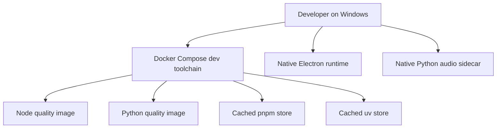

# Docker Development Design

**Spec**: `.specs/features/docker-development/spec.md`
**Status**: Draft

---

## Architecture Overview

The first Docker milestone is a development toolchain, not the runtime product.

---

## Code Reuse Analysis

### Existing Components to Leverage

| Component | Location | How to Use |
| --- | --- | --- |
| Root package manager config | `package.json` | Pin pnpm version and workspace tooling |
| Desktop app scripts | `apps/momai/package.json` | Reuse lint, typecheck, test commands |
| Python app scripts | `apps/core/package.json` | Reuse uv-based test commands |
| Existing Docker ignore | `.dockerignore` | Expand it for Docker context safety |
| Security baseline | PR `#247` changes | Reuse hardened extension/auth assumptions |

### Integration Points

| System | Integration Method |
| --- | --- |
| Node toolchain | Linux container with workspace mounts and frozen install |
| Python toolchain | Linux container with frozen uv lock |
| GitHub Actions | Separate container CI workflow |

---

## Components

### Node Quality Image

- **Purpose**: Run lint, typecheck, and Vitest in a Linux container.
- **Location**: `docker/development/Dockerfile.node`
- **Interfaces**:
  - `pnpm docker:lint`
  - `pnpm docker:typecheck`
  - `pnpm docker:test`
- **Dependencies**: pnpm lockfile, Node 20, workspace sources
- **Reuses**: `apps/momai/package.json`, root `package.json`

### Python Quality Image

- **Purpose**: Run `uv sync --frozen` and pytest in a Linux container.
- **Location**: `docker/development/Dockerfile.python`
- **Interfaces**:
  - `pnpm docker:test:core`
- **Dependencies**: `apps/core/pyproject.toml`, `apps/core/uv.lock`
- **Reuses**: `apps/core/package.json`

### Docker Compose Dev Harness

- **Purpose**: Provide a repeatable local entry point for containerized dev commands.
- **Location**: `docker/development/compose.yaml`
- **Interfaces**:
  - `docker compose up`
  - `docker compose run --rm ...`
- **Dependencies**: both Dockerfiles, volumes, environment contract
- **Reuses**: existing scripts and test commands

### Container CI Workflow

- **Purpose**: Validate Docker images and prevent drift between local and CI usage.
- **Location**: `.github/workflows/container-ci.yml`
- **Interfaces**:
  - build, lint, scan, smoke test
- **Dependencies**: Dockerfiles, Compose, GitHub Actions cache
- **Reuses**: current CI gating approach

---

## Error Handling Strategy

| Error Scenario | Handling | User Impact |
| --- | --- | --- |
| Docker not installed | fail fast with a clear setup message | developer can install Docker Desktop |
| Frozen install mismatch | stop the build | forces dependency drift to be fixed |
| Host workspace contamination | fail the validation step | preserves Windows checkout integrity |
| Missing model fixture | skip model-based dev smoke, use mock | keeps first milestone lightweight |

---

## Risks & Concerns

| Concern | Location (file:line) | Impact | Mitigation |
| --- | --- | --- | --- |
| Existing Dockerfile is a build image, not runtime | `scripts/Dockerfile.linux:1-25` | confusing reuse and wrong image shape | keep a separate development Dockerfile tree |
| Python voice/audio is host-bound | `apps/core/main.py`, `apps/core/services/voice/*` | Docker Desktop cannot access Windows audio directly | keep voice local in Stage A |
| Node Core and Python are coupled by local assumptions | `apps/momai/src/main/coreManager.ts` | full runtime containerization is too early | start with toolchain-only Docker |
| Model downloads are large | `apps/momai/scripts/node-core/services/model-downloader.js` | slow builds and big images | use verified volumes, not model layers |

---

## Tech Decisions

| Decision | Choice | Rationale |
| --- | --- | --- |
| First Docker milestone | toolchain only | lowest risk, highest DX value |
| Model strategy for dev | verified volume | avoids giant images |
| Future direction | appliance single-user | keeps the roadmap coherent |
| Runtime product in Stage A | native | preserves current behavior |
