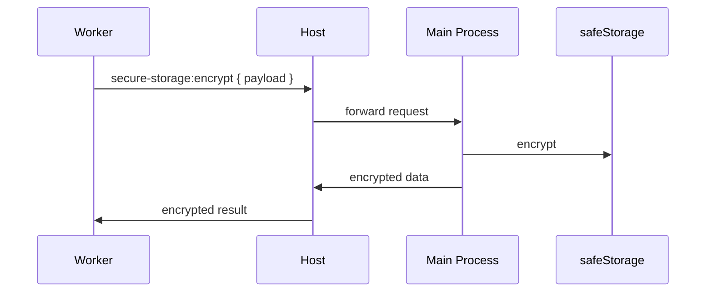

# Extension Data Guide

## Storage API

Extensions have access to isolated key-value storage scoped to their own ID.

### SDK Methods

```typescript
// Read a value
await sdk.storage.get<T>('my-key')
// => T | null

// Read with version suffix
await sdk.storage.get<T>('my-key', { version: '1.0' })
// => reads from key `my-key@1.0`

// Write a value
await sdk.storage.set('my-key', { hello: 'world' })

// Read multiple keys
await sdk.storage.getMany(['key1', 'key2'])
// => { key1: ..., key2: ... }

// Write multiple keys
await sdk.storage.setMany({ key1: 'val1', key2: 'val2' })

// Delete a key
await sdk.storage.delete('my-old-key')

// List all keys
const keys = await sdk.storage.listKeys()
// => ['key1', 'key2', ...]

// Migrate data format
await sdk.storage.migrate('1.0', '2.0', (oldData) => {
  return { ...oldData, newField: 'default' }
})
```

### Storage Backend

#### Development (SDK Mock)
In development (when using the SDK in the renderer via `getSDK()`), storage is in-memory (`Map<string, any>`). Data is not persisted between reloads.

#### Production (Host Worker)
In the isolated worker (`extension-host-worker.js`), storage is file-based:

```
{dataDir}/extensions/{extId}/
├── my-key.json
├── my-other-key.json
└── settings.json
```

- Each key is stored as a separate JSON file.
- Keys must match `^[a-zA-Z0-9_-]+$` (alphanumeric, underscores, hyphens).
- Values are JSON-serialized.
- Individual value size limit: 1 MB.
- Storage is created on first write (`fs.mkdir` recursive).

## Storage Versioning and Migration

### Using Versioned Keys

The `storage.get()` method accepts an optional `version` parameter that appends `@{version}` to the key:

```typescript
// Write versioned data
await sdk.storage.set('config@1.0', { theme: 'dark' })

// Read versioned data (equivalent)
await sdk.storage.get('config', { version: '1.0' })
```

### Migration Function

When you change the format of stored data, use `storage.migrate()`:

```typescript
// Step 1: Write data in old format
await sdk.storage.set('user@1.0', { name: 'Alice', age: 30 })

// Step 2: Migrate to new format
await sdk.storage.migrate('1.0', '2.0', (old) => ({
  fullName: old.name,
  yearsOld: old.age,
  migratedAt: Date.now()
}))

// Step 3: Read in new format
const user = await sdk.storage.get('user', { version: '2.0' })
// => { fullName: 'Alice', yearsOld: 30, migratedAt: ... }
```

### Host-Side Migration Registry

For more complex migrations (cross-extension or data transformations), the host provides a migration registry:

```javascript
const { registerMigration, runMigrations } = require('extension-storage-migrate')

registerMigration('1.0', '2.0', async (extId) => {
  // Transform all storage for this extension
})
```

## Config (Host-Managed)

Use `sdk.config` for values that should survive extension reinstallation:

```typescript
// Store a config value
await sdk.config.set('api_key', 'sk-...')

// Read it back
const key = await sdk.config.get('api_key')

// Delete it
await sdk.config.delete('api_key')
```

Config is stored by the host at the app level, separate from extension storage. When an extension is uninstalled and reinstalled, config values are preserved.

## Keychain (Secure Storage)

For sensitive data (credentials, tokens), use the secure storage system. This uses the OS keychain (safeStorage on Electron):



### Worker API

```javascript
// In runtime.js, using the momai bridge:
// Encryption is handled automatically by the host.
// Store encrypted data using momai.storage:
await momai.storage.set('credentials', {
  accessToken: '<encrypted>',
  refreshToken: '<encrypted>'
})
```

The worker doesn't have direct access to encryption keys. All secure storage operations go through the host, which forwards them to the Electron main process (the only component with OS keychain access).

## Storage Declaration (Privacy)

Extensions should declare their storage usage in `manifest.json`:

```json
{
  "storage": {
    "description": "Stores authentication tokens and message history locally.",
    "locations": ["auth/*.json", "messages/*.json"]
  }
}
```

This information is shown to the user in the Privacy view via `manifest-storage.js`:

```javascript
const { collectStoredData } = require('manifest-storage')
// Returns: [{ skillId, skillName, description, locations }]
```

## Best Practices

1. **Version your data** from day one — even if it feels unnecessary. Adding versions later is harder.
2. **Write migration functions** for every format change — don't break existing users.
3. **Use config for secrets** — `sdk.config.*` is host-managed and survives reinstallation.
4. **Keep values small** — under 100 KB per key for good performance. The hard limit is 1 MB.
5. **Clean up old data** — after a migration, delete keys from old versions.
6. **Declare all storage locations** in the manifest for transparency.
7. **Use descriptive key names** — treat keys like a filesystem namespace (`settings.theme`, `auth.token`).
