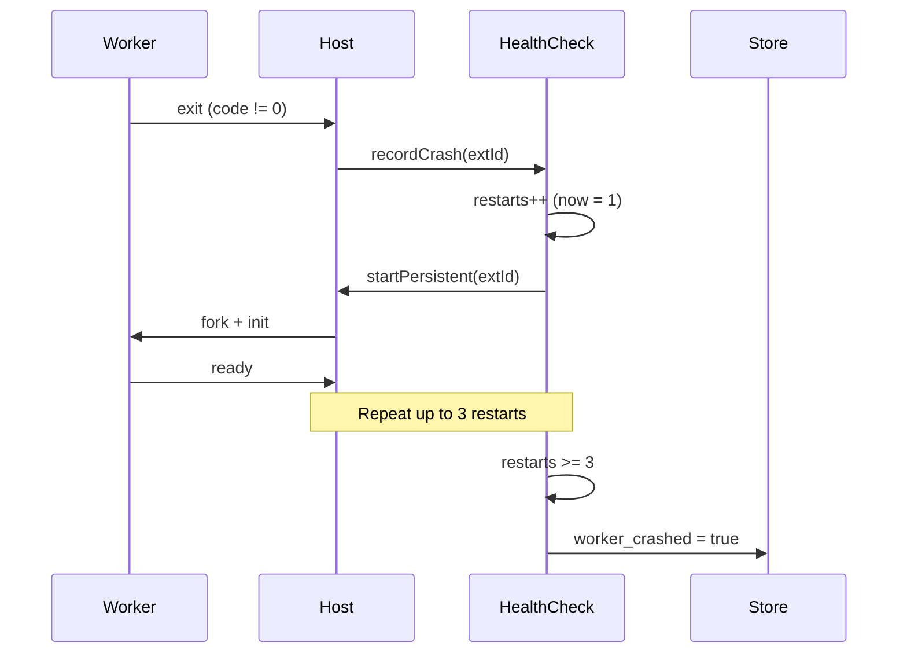

# Extension Worker Guide

## Overview

Extensions run as isolated Node.js worker processes, forked from the main extension host manager. This provides:

- **Isolation**: A crash in one extension doesn't affect the host or other extensions.
- **Security**: Restricted environment with limited PATH, no access to host internals.
- **Restart**: Automatic crash recovery with health check heartbeat.
- **Pooling**: Stateless (non-persistent) extensions use a worker pool for efficiency.

## Worker Types

### Stateless (Pooled)

For extensions without `background: true` in their manifest. On each execution:

1. A worker is fetched from the pool (or created).
2. The extension's `runtime.js` is loaded and `execute()` is called.
3. After execution, the worker returns to the pool for reuse.
4. Idle workers are killed after 30 seconds of inactivity.

Pool limits: 2 workers per extension ID.

### Persistent (Background)

For extensions with `background: true` in their manifest. A dedicated long-lived process:

1. Created on extension activation.
2. Receives commands via IPC messages.
3. Emits events back to the host.
4. Sends heartbeat pings every 30 seconds.
5. Auto-restarted on crash (up to 3 times).

## Health Check Heartbeat

Persistent workers send a heartbeat message every 30 seconds:

```javascript
setInterval(() => {
  process.send({ type: 'heartbeat', timestamp: Date.now() })
}, 30000)
```

The health check system monitors these heartbeats:

| Parameter | Value |
|-----------|-------|
| Heartbeat interval | 30 seconds (sent by worker) |
| Check interval | 15 seconds (checked by host) |
| Timeout threshold | 90 seconds (3 missed pings) |
| Max restarts | 3 |

If a heartbeat is missed for 90 seconds, the host:

1. Logs the timeout.
2. Increments the restart counter.
3. If restarts < 3, spawns a new worker.
4. If restarts >= 3, marks the extension as `worker_crashed` in the store.

## Crash Recovery

### Persistent Worker Crash



### Cleanup on App Quit

When the app quits:

1. `stopPersistent` sends a `shutdown` message to the worker.
2. Waits up to 5 seconds for graceful shutdown.
3. If the `persistOnQuit` tool is declared, it's called before shutdown.
4. If the worker doesn't exit gracefully, it's killed forcefully.

```javascript
stopPersistent(skillId) {
  child.send({ type: 'shutdown' })
  // 5 second grace period
  setTimeout(() => {
    if (!child.killed) child.kill()
  }, 5000)
}
```

## Rollback

When an extension update fails or causes crashes:

1. The store keeps the previous version's files in a backup directory.
2. On startup, if `worker_crashed` is detected, the host attempts to load the previous version.
3. If the previous version also fails, the extension is disabled.
4. The user is notified and can manually re-enable.

The rollback system checks:

- Worker crashes within the first 60 seconds of startup.
- Consecutive crashes across app restarts.
- Manifest validation errors on the new version.

## Worker Environment

### Environment Variables

| Variable | Description |
|----------|-------------|
| `MOMAI_EXTENSION_ID` | The extension ID |
| `MOMAI_PERSISTENT` | `"true"` if persistent worker |
| `MOMAI_DATA_DIR` | Path to data directory |
| `NODE_PATH` | Node module resolution paths (extension's `node_modules` + host) |

### Safe Environment

Workers receive a sanitized environment:

```javascript
const SAFE_ENV = {
  PATH: process.env.PATH,
  HOME: process.env.HOME,
  USERPROFILE: process.env.USERPROFILE,
  SystemRoot: process.env.SystemRoot,
  WINDIR: process.env.WINDIR,
  APPDATA: process.env.APPDATA,
  LOCALAPPDATA: process.env.LOCALAPPDATA,
  TMP: process.env.TMP,
  TEMP: process.env.TEMP,
  NODE_PATH: process.env.NODE_PATH,
  ELECTRON_RUN_AS_NODE: '1'
}
```

## Worker IPC Protocol

### Host → Worker

```typescript
{ type: 'execute', requestId: number, payload: any }
{ type: 'shutdown' }
```

### Worker → Host

```typescript
{ type: 'ready' }
{ type: 'heartbeat', timestamp: number }
{ type: 'response', requestId: number, result: any }
{ type: 'log', message: string }
{ type: 'event', eventType: string, data: any }
{ type: 'structured_response', data: any }
{ type: 'secure-storage:encrypt', requestId: number, payload: any }
{ type: 'secure-storage:decrypt', requestId: number, payload: any }
```

### Request Lifecycle

1. Host sends `{ type: 'execute', requestId: 1, payload: ... }`.
2. Worker processes and responds `{ type: 'response', requestId: 1, result: ... }`.
3. Pending requests have a 30-second timeout.
4. If the worker exits before responding, all pending requests are rejected.

## Worker Pool Management

Stateless extensions use a worker pool to avoid the overhead of forking on every call:

- Max 2 workers per extension.
- Workers are reused via idle pool.
- Idle workers are killed after 30 seconds.
- Pool timer checks every 15 seconds.
- If pool is at capacity, caller waits for an available worker (up to 15 seconds).

## Require Interceptor

Workers use a require interceptor (`config/extension-allowlist.js`) that restricts which modules can be loaded:

```javascript
Module.prototype.require = createRequireInterceptor(originalRequire)
```

This prevents extensions from loading arbitrary host modules. Only allowed modules pass through.
